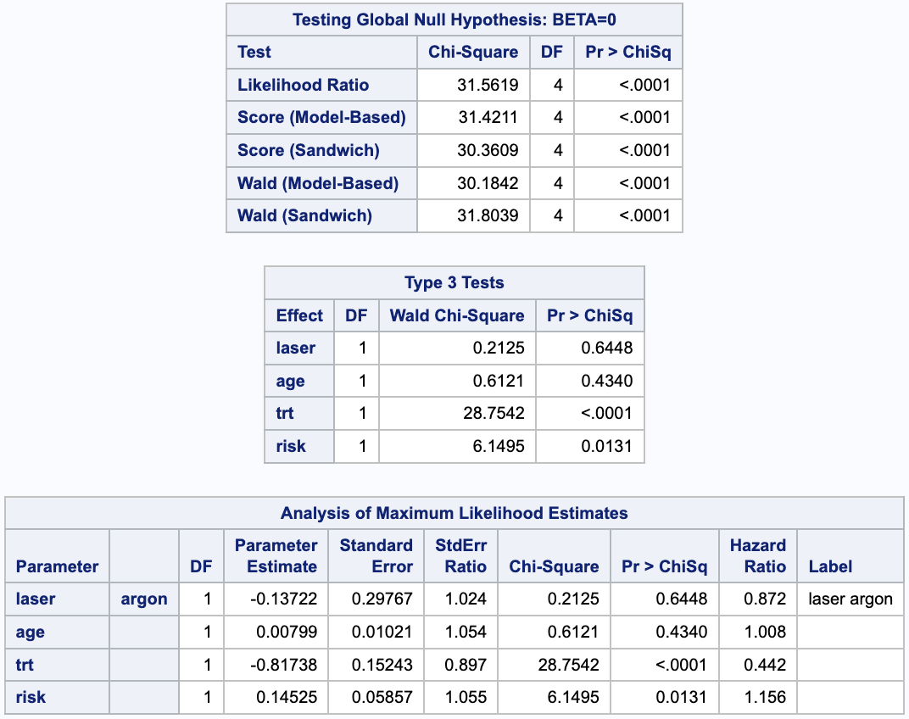

```{r setup, include=FALSE}
knitr::opts_chunk$set(echo = FALSE, message = FALSE, warning = FALSE)
library(tidyverse)
library(knitr)
library(kableExtra)
library(survival)
library(flexsurv)
library(survminer)
library(survMisc)
library(MASS)
```

Since the events for right eye and left eye are not recurrent events, we cannot order which event come "first" and it is not proper to exclude subjects outside the risk set of the other eye even if the subject had a event before in another eye. Therefore it is better to use a marginal approach, which is the WLW methods. 


**Method 1**: Wei ‐Lin‐Weissfeld (WLW) method

- Events are ORDERED or CLASSIFIED INTO DIFFERENT TYPES

- The order/type is used as a stratification factor

  - Correlation among strata due to cluster effect ‐ different types of events occurred in the same subjects
  
- Apply stratified Cox proportional hazard regression model

  - Time scale: Time from the study entry or randomization to the different types of events

  - Risk set - A marginal approach 
  
    - Each stratum has its own risk set
    
    - All subjects are eligible in the risk set for the analysis of all stratums at the beginning
    
  - Regression:
  
    - Covariates can be stratum‐specific
    
    - Effect parameter can be 
    
      - Strata‐specific
      
      - Common effect
      
- WLW Method Structure Data for analysis:

  - Structure data set for K types of events: Form K strata

  - Observations are in counting process style (start, stop):

    - Start – always study entry or randomization
    
		- Stop – the kth event time or censored
		
		- Id – cluster indicator
		
		- Strata indicator -- for the K types of events
		
		- Censoring indicator 
		
	- Each subject has K observations --> K strata


The dataset `Diabetic` from the `survival` package satisfies the structure for WLW method, therefore, I implement the WLW method analysing both stratum specific treatment effects and the common effects.

First, let's look at the stratum specific effect.

```{r diabetic_dat_manipulations, eval = F}
diabetic = survival::diabetic
# For WLW method
diabetic_WLW = diabetic %>% mutate(
  eye_ind = ifelse(eye == "left", 1,2),
  laser_ind = ifelse(laser == "argon", 0, 1)
) %>% 
  select(-eye,-laser)
write_csv(diabetic_WLW,"diabetic_WLW.csv")

```


```{r WLW_strata, echo=FALSE, out.width = '80%', fig.align='center',fig.pos="H"}

```

```{r WLW_strata_test, echo=FALSE, out.width = '80%', fig.align='center',fig.pos="H"}

```

From the above stratum specific analysis results, we found that the treatment effect to the Left eye (trtL) and Right eye (trtR) are both significant, and it seems that the effect is greater for left eye than the right eye (hazard ratio 0.260 vs. 0.595). The test results also shows that the treatment effects are significantly different.


Here are the analysis results for the common effect.

```{r WLW_strata_common, echo=FALSE, out.width = '80%', fig.align='center',fig.pos="H"}

```

From the above result, we can see that the hazard ratio for the common treatment effect is 0.442, and it's significant. That means patients with treatment reduces the risk of recurrence by a factor of 0.442 compared to patients without laser treatment, holding other effects.

```{r sascode, eval = F}
proc import out = diabetic_WLW
	datafile="/home/u62725158/diabetic_WLW.csv"
	dbms=csv
	replace;
	GETNAMES=yes;
run;

proc import out = diabetic
	datafile="/home/u62725158/Diabetic.csv"
	dbms=csv
	replace;
	GETNAMES=yes;
run;


title'Wei-Lin-Weissfeld Model';
proc phreg data=diabetic_WLW covs(aggregate);
	/*class laser;*/
	model time*status(0)=laserL laserR ageL ageR trtL trtR riskL riskR;
	laserL = laser_ind * (eye_ind = 1);
	laserR = laser_ind * (eye_ind = 2);
	ageL = age * (eye_ind = 1);
	ageR = age * (eye_ind = 2);
	trtL = trt * (eye_ind = 1);
	trtR = trt * (eye_ind = 2);
	riskL = risk * (eye_ind = 1);
	riskR = risk * (eye_ind = 2);
	strata eye_ind;
	id id;
	TREATMENT: test trtL,trtR/average e;
run;

title'Wei-Lin-Weissfeld Model for 
Common Effect';
proc phreg data=diabetic
	covs(aggregate);
	class laser eye;
	model time*status(0)=laser age trt risk;
	strata eye;
	id id;
run;


title'Frailty Model for Common Effect';
proc phreg data=diabetic ;
class id laser eye;
model time*status(0)=laser age trt risk;
random id;
hazardratio'Frailty Model Analysis' trt;
run;
```


\newpage

**Method 2:** Frailty Model

Another way to deal with the correlation of different types of events for the same subject is to treat it as random effect: either left eye or right eye getting vision loss from the same subjects may share similar risk, thus subjects are considered as random effect by applying frailty model. There are j = 197 subjects in this study, so values $r_1$, $r_2$, ..., $r_{197}$ represent the frailty of developing events. The shared frailty model for the ith events in the jth group:

$$h_{ij}\left(t \mid Z_{ij}\right) =\xi_jh_0(t)e^{\beta'Z_{ij}}$$
Here, I assume $\xi_j = e^{r_j}$ follows log-normal distribution with mean 0.

```{r WLW_strata_frailty, echo=FALSE, out.width = '80%', fig.align='center',fig.pos="H"}

```

From the frailty model, we can see that the hazard ratio for the common treatment effect is 0.403, and it's significant. That means patients with treatment reduces the risk of recurrence by a factor of 0.403 compared to patients without laser treatment, holding other effects.

\newpage

## Appendix: Code for this report

```{r ref.label=knitr::all_labels(), echo=TRUE, eval=FALSE}
```


