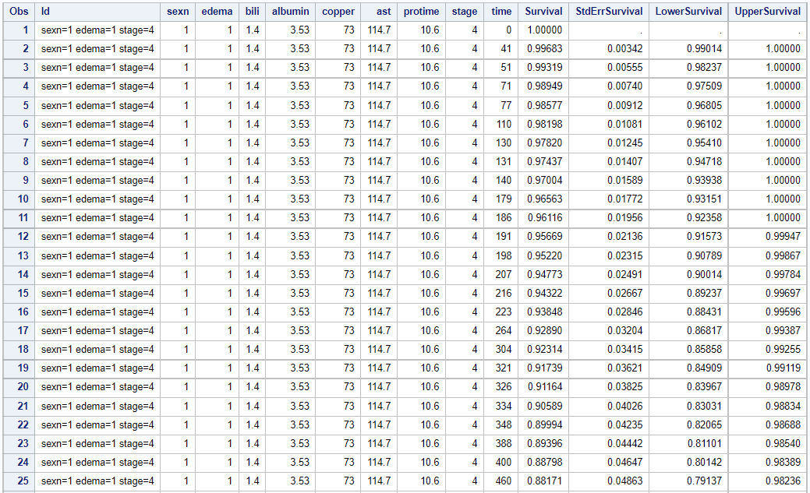

```{r setup, include=FALSE}
knitr::opts_chunk$set(echo = FALSE, message = FALSE, warning = FALSE)
library(tidyverse)
library(knitr)
library(kableExtra)
library(survival)
```

## Problem 1

1. Potential confounding factors for the observed dose-response in efficacy

To deal with the potential confounding factors, the following analysis should be considered:

- **Identify the Confounders**: Identify the potential confounding factors by observing imbalanced baseline characteristics between the two doses and applying hypothesis tests with one-sided significance level of 0.05.

- **Identify Prognostic Factors**: Each factor was tested individually by controlling the dose and significant factors were kept as the confounding factors.

- **Adjust for Confounding Effects**: Control all the selected confounding factors, so the dose response relationship was more significant for certain endpoints. Multiplicity issues were discussed for multiple tests.

2. If there were any dose by baseline interactions?

There could be interactions, the interactions could either be one way or multiple ways. We can use the identified potential confounding factors to fit the interaction. We could add the interaction terms in to the proportional hazard model and test whether the effect of interactions are significant or not.

The statistically significant interactions found from this type of analysis are actually artifact of multiple testing and cannot be interpreted, since there could be infinitely many combinations of interactions. 

Since we have already addressed multiplicity issues for multiple tests when identify the potential confounding factors. There is the chance to show statistically significant interactions but actually we don’t believe then to be true.
 

\newpage

## Problem 2

(a) Please estimate the survival time that 90\% subjects survived for baseline survival function.

Here I shows the plot of the estimated survival function for baseline covariates.

```{r p2a-survcurve, echo=FALSE, fig.cap="Survival Fucntion for Baseline Covariates", out.width = '80%', fig.align='center',fig.pos="H"}

```

I also shows the table of estimated survial function for baseline survival function. Considering the space limitation, I only shows the survival which close to the target level, 90\%.

```{r p2a-survtab, echo=FALSE, fig.cap="Survival Fucntion Table for Baseline Covariates", out.width = '80%', fig.align='center',fig.pos="H"}

```

From the above result, the survival time that 90\% subjects survived for baseline survival function is estimated to be 3090 days.

(b) Please estimate the survival time that 90\% subjects survived for male subjects who had edema and stage=4 and taking median for all other covariates in the model.

```{r p2b-survcurve, echo=FALSE, fig.cap="Survival Fucntion for Specific Covariates", out.width = '80%', fig.align='center',fig.pos="H"}

```

```{r p2b-survtab, echo=FALSE, fig.cap="Survival Fucntion Table for Specific Covariates", out.width = '80%', fig.align='center',fig.pos="H"}

```

The survival time that 90\% subjects survived for male subjects who had edema and stage = 4 and taking medians for all other covariates is estimated to be 348 days based on the result.

\newpage

## Problem 3

I performed the backward model selection using PBC data. The selection started from the whole model which contains all variable.

Here is the final model resulted from the backward selection procedure.

```{r p3-finalmodel, echo=FALSE, fig.cap="Final Model from Backward Selection Procedure", out.width = '80%', fig.align='center',fig.pos="H"}

```

As we can see from the results above, the variables in the final model are `sex`, `edema`, `bili`, `albumin`, `copper`, `ast`, `protime`, `stage`, which are the same as what we have in the stepwise method. That may because I choose the same criterion that is `slstay=0.15` as what we did in stepwise selection procedure.

Here is the summary of the backward selection procedure, which shows which and when the variables are eliminated.
```{r p3-backwardsum, echo=FALSE, fig.cap="Backward Selection Procedure Summary", out.width = '80%', fig.align='center',fig.pos="H"}

```

\newpage

## Reference:

 1. Munshi, N. C., Anderson, L. D., Jr, Shah, N., Madduri, D., Berdeja, J., Lonial, S., Raje, N., Lin, Y., Siegel, D., Oriol, A., Moreau, P., Yakoub-Agha, I., Delforge, M., Cavo, M., Einsele, H., Goldschmidt, H., Weisel, K., Rambaldi, A., Reece, D., Petrocca, F., … San-Miguel, J. (2021). Idecabtagene Vicleucel in Relapsed and Refractory Multiple Myeloma. The New England journal of medicine, 384(8), 705–716. https://doi.org/10.1056/NEJMoa2024850

```{sas eval = F}
proc import out = pbc
	datafile = "/home/u62725158/pbc.csv"
	dbms = csv replace;
	getnames = yes;
run;

data pbc;
	set pbc;
	if sex='f' then sexn=0; else sexn=1;
	
	if chol="NA" then chol="";
    if trig="NA" then trig="";
    if platelet="NA" then platelet="";
    chol_new = input(chol, 8.);
    drop chol;
    rename chol_new=chol;
    trig_new = input(trig, 8.);
    drop trig;
    rename trig_new=trig;
    platelet_new = input(platelet, 8.);
    drop platelet;
    rename platelet_new=platelet;
run;

* Problem 2.a;
data covar;
	length Id $20;
	input Id $1-10 sexn edema bili albumin copper ast protime stage ; 
	datalines;
baseline  0 0 0 0 0 0 0 0
;
run;

proc phreg data=pbc plots(overlay)=survival;
	class sexn;
	model time*status(0) = sexn edema bili albumin copper ast protime stage;
	baseline covariates=covar out=Pred1 survival=_all_/rowid=Id; 
run;

proc print data=Pred1(FIRSTOBS = 110 OBS = 125); run;

* Problem 2.b;
proc means data=pbc median;
var bili albumin copper ast protime;
run;

data covar2;
	length Id$ 50;
	input sexn edema bili albumin copper ast protime stage Id $30-60;
	datalines;
	1 1 1.4 3.53 73 114.7 10.6 4 sexn=1 edema=1 stage=4
	;
run;

proc phreg data=pbc plots(overlay)=survival;
	class sexn;
	model time*status(0) = sexn edema bili albumin copper ast protime stage;
	baseline covariates=covar2 out=Pred2(FIRSTOBS = 15 OBS = 25) survival=_all_/rowId=Id;
run;

proc print data=Pred2; run;

* Problem 3;
proc phreg data=pbc;
  class trt sexn;
  model time*status(0) = trt sexn ascites hepato spiders edema bili chol albumin copper alk.phos 
  ast trig platelet protime stage/selection=backward slentry=0.25 slstay=0.15 details; 
run;

ods rtf close;
```

\newpage

## Appendix: Code for this report

```{r ref.label=knitr::all_labels(), echo=TRUE, eval=FALSE}
```

