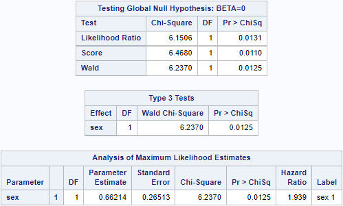
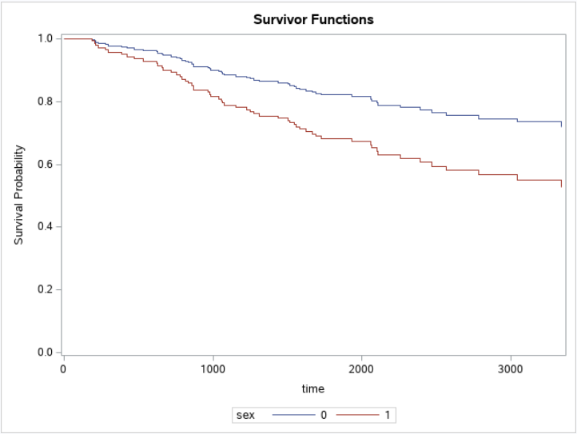
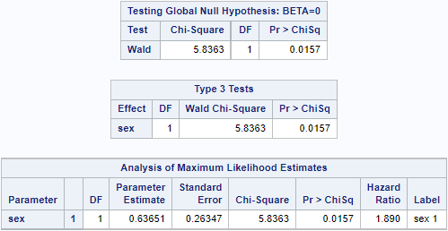
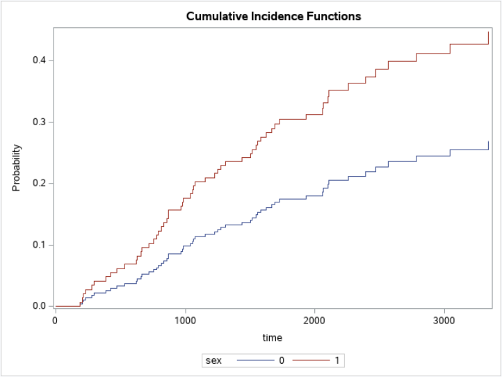

```{r setup, include=FALSE}
knitr::opts_chunk$set(echo = FALSE, message = FALSE, warning = FALSE)
library(tidyverse)
library(knitr)
library(kableExtra)
library(survival)
library(flexsurv)
library(survminer)
library(survMisc)
library(MASS)
```

# Homework 9

## Problem 1

Since $T_i\sim LN(\mu,\sigma^2)$, we have the p.d.f. of the log-normal:
$$f(t) = \frac{1}{t\sigma\sqrt{2\pi}}\exp{\left(-\frac{(\ln t - \mu)}{2\sigma^2}\right)}$$
The log-likelihood of the sample $\{t_1,t_2,\ldots,t_n\}$ is:

$$LL = -\frac{n}{2}\ln(2\pi) - \frac{n}{2}\ln\sigma^2-\frac{1}{2\sigma^2}\sum_{i=1}^{n}(\ln t_i - \mu)^2 - \sum_{i=1}^{n}\ln t_i$$

Taking the F.O.C. with respect to $\mu$ and $\sigma$, and set them to zero, we can get:
$$
\begin{aligned}
\frac{\partial LL}{\partial \mu} & = \frac{1}{\sigma^2}\left(\sum_{i=1}^{n}\ln t_i - \mu\right) = 0\\
\frac{\partial LL}{\partial \sigma^2} & = -\frac{n}{2\sigma^2}+\frac{\sum_{i=1}^{n}(\ln t_i - \mu)^2 }{2\sigma^4} = 0
\end{aligned}
$$

We can solve them MLE $\hat\mu, \hat\sigma^2$ from the above equations:
$$
\begin{aligned}
\hat\mu &= \frac{1}{n}\sum_{i=1}^{n}\ln t_i\\
\hat\sigma^2 &= \frac{1}{n}\sum_{i=1}^{n}(\ln t_i - \hat\mu)^2
\end{aligned}
$$
Therefore, MLEs have closed form.

## Problem 2

I plot the survival function using K-M estimator and the survival functions from parametric models.  
  
```{r para_surv}
dists <- c("exp", "weibull", "gompertz", "gamma", 
           "lognormal", "llogis", "gengamma")
dists_long <- c("Exponential", "Weibull (AFT)",
                "Gompertz", "Gamma", "Lognormal", "Log-logistic",
                "Generalized gamma")
parametric_surv <- vector(mode = "list", length = length(dists))
for (i in 1:length(dists)){
  fit <- flexsurvreg(Surv(futime, fustat) ~ 1, data = ovarian, dist = dists[i]) 
  parametric_surv[[i]] <- summary(fit, type = "survival", 
                                     ci = FALSE, tidy = TRUE)
  parametric_surv[[i]]$method <- dists_long[i]
}

parametric_surv_df <- do.call("rbind", parametric_surv)
#parametric_surv <- rbind(parametric_surv[[1]], parametric_surv[[2]], parametric_surv[[3]],parametric_surv[[4]],parametric_surv[[5]],parametric_surv[[6]],parametric_surv[[7]])

km.fit <- survfit(Surv(futime, fustat) ~ 1, data = ovarian)
km_surv <- data.frame(time = km.fit$time, est = km.fit$surv, method = "Kaplan-Meier")
surv_df <- rbind(km_surv, parametric_surv_df)

surv_df$method = factor(surv_df$method,
                       levels = c("Kaplan-Meier",
                                  dists_long))

ggplot(surv_df, aes(x = time, y = est, col = method, linetype = method)) +
  geom_step(data = surv_df[surv_df$method == "Kaplan-Meier",], aes(x =time, y = est, col = method, linetype = method)) +
  geom_line(data = surv_df[surv_df$method != "Kaplan-Meier",], aes(x = time, y = est, col = method, linetype = method)) +
  xlab("Days") + ylab("Survival") + 
  scale_colour_manual(name = "", 
                      values = c("black", rainbow(7)),
                      breaks = c("Kaplan-Meier", dists_long)) +
  scale_linetype_manual(name = "",
                        values = c(1,rep_len(2:6, 7)),
                        breaks = c("Kaplan-Meier", dists_long)) +
  theme_survminer()


```

From the above plot, we see that the survival function estimates from parametric models are pretty close (at least visually), and none of them seems similar to the K-M estimator visually. Therefore, I plot the hazard functions corresponding to these survival functions to see if there exists any similarity.

```{r para_haz}
library("muhaz")
kernel_haz_est <- muhaz(ovarian$futime, ovarian$fustat)
kernel_haz <- data.frame(time = kernel_haz_est$est.grid,
                         est = kernel_haz_est$haz.est,
                         method = "Kernel density")
parametric_haz <- vector(mode = "list", length = length(dists))
for (i in 1:length(dists)){
  fit <- flexsurvreg(Surv(futime, fustat) ~ 1, data = ovarian, dist = dists[i]) 
  parametric_haz[[i]] <- summary(fit, type = "hazard", 
                                     ci = FALSE, tidy = TRUE)
  parametric_haz[[i]]$method <- dists_long[i]
}

parametric_haz_df <- do.call("rbind", parametric_haz)
#parametric_surv <- rbind(parametric_surv[[1]], parametric_surv[[2]], parametric_surv[[3]],parametric_surv[[4]],parametric_surv[[5]],parametric_surv[[6]],parametric_surv[[7]])

#km_haz <- data.frame(time = km.fit$time, est = km.fit$cumhaz, method = "Kaplan-Meier")
#km_haz$est = c(km_haz$est[1],diff(km_haz$est))
haz_df <- rbind(kernel_haz, parametric_haz_df)

ggplot(haz_df, aes(x = time, y = est, col = method, linetype = method)) +
  geom_line() +
  xlab("Days") + ylab("Hazard") + 
  scale_colour_manual(name = "", 
                      values = c("black", rainbow(7)),
                      breaks = c("Kernel density", dists_long)) +
  scale_linetype_manual(name = "",
                        values = c(1,rep_len(2:6, 7)),
                        breaks = c("Kernel density", dists_long)) +
  theme_survminer()


```

From the hazard function plot above, although there is diffence between different parametric models, none of them is similar to the non-parametric estimator. 


## Problem 3

The likelihood of Weibull distribution is:
$$\begin{aligned} 
L(\beta) & =\prod_{i=1}^n h\left(T_i\mid Z_i\right)^{\Delta_i} S\left(T_i\right) \\ 
& = \prod_{i=1}^n \left(h_0(T_i)e^{\beta Z_i}\right)^{\Delta_i}e^{-\lambda T_i^\alpha}\\
& =\prod_{i=1}^n\left(\lambda \alpha T_i^{\alpha-1}e^{\beta Z_i}\right)^{\Delta_i} e^{-\lambda T_i^\alpha}\\
& = \left(\lambda \alpha \times16^{\alpha-1}e^{\beta}\right)^{1} e^{-\lambda \times 16^\alpha}\times  e^{-\lambda 
\times 20^\alpha} \\
&\times \left(\lambda \alpha \times12^{\alpha-1}\right)^{1} e^{-\lambda \times 12^\alpha} \times e^{-\lambda \times 14^\alpha}\\
& \times \left(\lambda \alpha \times11^{\alpha-1}\right)^{1} e^{-\lambda \times 11^\alpha}\\
& \times \left(\lambda \alpha \times9^{\alpha-1}e^{\beta}\right)^{1} e^{-\lambda \times 9^\alpha}\\
& = (\lambda\alpha)^4(16^{\alpha-1}12^{\alpha-1}11^{\alpha-1}9^{\alpha-1})e^{2\beta - \lambda(16^\alpha+20^\alpha+12^\alpha+14^\alpha+11^\alpha+9^\alpha)}
\end{aligned}$$


## Problem 4

```{r aft_log_logistic}
leu_dat = readxl::read_excel("Datasets.xlsx", sheet = "Leukaemia")
leu_dat$trt = relevel(factor(leu_dat$trt), ref = "Control")
leuk.aft <- survreg(Surv(time, event == 1) ~ trt, leu_dat,
                      dist = "loglogistic")
summary(leuk.aft)
```
From the AFT model summary, we can see that the coefficient corresponds to the treatment effect is 
significant, which means that the treatment 6-MP has a significant effect on the survival of patients with Acute Myelogenous Leukemia.

The corresponding model is:
$$
\log T_i = 1.8927 + 1.2655\times I(\text{trt}_i=\text{ 6-MP})
$$

\newpage

# Homework 10

## Problem 1

Write down the definition of the overall hazards, cause specific hazards,and sub-distribution hazards. Describe the relationship and differences.

- Hazard Function : $$
h(t)=\lim _{\Delta t \rightarrow 0} \frac{P(t<T \leq t+\Delta t \mid T \geq t)}{\Delta t}
$$
- Cause Specific Hazards: $$
h_k(t)=\lim _{\Delta t \rightarrow 0} \frac{P(t<T \leq t+\Delta t, \Delta=k \mid T \geq t)}{\Delta t}
$$
for $k=1,2, \ldots, K$ and no overlapping among the different types of events

- Sub-distribution hazard functions
$$
h_k^s(\mathrm{t})=\lim _{\Delta t \rightarrow 0} \frac{P(t \leq T<t+\Delta t, \Delta=k \mid T \geq t \cup(T<t \cap \Delta \neq k))}{\Delta t}
$$
**Relationship**

$$
h(t)=\sum_{k=1}^K \lim _{\Delta t \rightarrow 0} \frac{P(t<T \leq t+\Delta t, \Delta=k \mid T \geq t)}{\Delta t}=\sum_{k=1}^K h_k(t)
$$
and 
$$
h_k(t) \neq h_k^s(t)
$$

\newpage

## Problem 2

Here is the cause-specific proportional hazard model results.

```{r p2a, echo=FALSE, out.width = '80%', fig.align='center',fig.pos="H"}

```

```{r p2b, echo=FALSE, out.width = '80%', fig.align='center',fig.pos="H"}

```


From the results above, we can see that the effect of sex on the death from melanoma is a risk increase about 93.9\%.

\newpage

## Problem 3

Here is the results of proportional hazard model using sub-distribution hazards, which is the Fine and Gray's method.

```{r p3a, echo=FALSE, out.width = '80%', fig.align='center',fig.pos="H"}

```

```{r p3b, echo=FALSE, out.width = '80%', fig.align='center',fig.pos="H"}

```
```{sas p2_3, eval = F}
proc import out = melanoma
	datafile="/home/u62725158/Datasets.xlsx"
	dbms=xlsx
	replace;
	sheet = "Melanoma";
	GETNAMES=yes;
run;

data Risk;
	sex = 0; output;
	sex = 1; output;
	format sex BEST.;
run;

* Problem 2 ;

proc phreg data = melanoma plots(overlay = stratum) = survival;
class sex (order = internal ref = first);
model time*status(2, 3) = sex;
Hazardratio 'Pairwise' sex / diff=pairwise;
baseline covariates=Risk out=out1 cif=_all_ /
seed = 8108;
run;


* Problem 3 ;

proc phreg data = melanoma plots(overlay = stratum) = cif;
class sex (order = internal ref = first);
model time*status(2) = sex/ eventcode = 1;
Hazardratio 'Pairwise' sex / diff=pairwise;
baseline covariates=Risk out=out1 cif=_all_ /
seed = 8108;
run;

proc lifetest data = melanoma plots= cif(test);
time time*status(2)/ eventcode = 1;
strata sex/ order=internal;
run;
```


From the results above, we can see that the effect of sex on the death from melanoma is a risk increase about 89.0\%.


\newpage

## Appendix: Code for this report

```{r ref.label=knitr::all_labels(), echo=TRUE, eval=FALSE}
```


